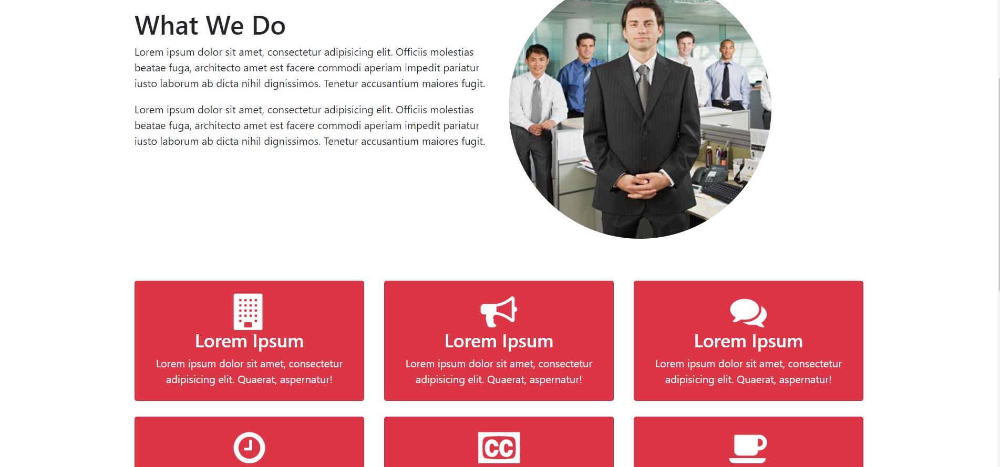

# glozzom

## Description
A stylish theme for a technological services company.  Theme features fullwidth image carousel header, parallax image scrolling, modal video player, service plan components, accordian FAQ section, testimonial section, image gallery, blog page and contact form

##### Landing Page Carousel Hero View

##### Photo Gallery and Video Player

##### What We Do View

##### Services Component View

Visit site [here](https://christopherconcannon.github.io/glozzom/)

## Table of Contents
  * [Installation](#installation)
  * [Usage](#usage)
  * [License](#license)
  * [Technologies](#technologies)
  * [Contributing](#contributing)
  * [Testing](#testing)
  * [Questions](#questions)
  
## Installation
Clone project to a directory on your local machine and cd into src directory.  
## Usage
Open index.html file in browser of your choice.  Navigate through site using links at top.  Click button to view video.   

## License 
This project is covered under the MIT license 

## Technologies
HTML5, CSS3, JavaScript, Bootstrap, jQuery

## Contributing
To see the guidelines adopted for contributing to this project, please view the [Contributor Covenant](https://www.contributor-covenant.org/version/2/0/code_of_conduct/code_of_conduct.txt)

## Testing
Tests coming soon

## Questions
Visit me at GitHub  
[christopherConcannon](https://github.com/christopherConcannon)
  
If you have any questions or would like to contact me, please email me at  
[cmcon@yahoo.com](mailto:cmcon@yahoo.com)
